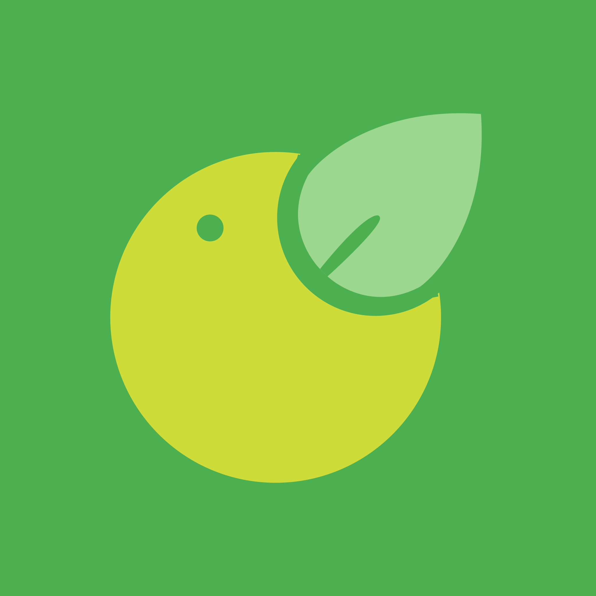

<p float="left">

</p>

# Meatless Frontend 🥬

Meatless is a delivery application for vegetarian food, offering a diverse menu of meat-free options for convenient ordering and delivery.


## Meatless API

In order to access the restaurant list data, use the endpoint below:

```bash
  https://raw.githubusercontent.com/evercodeinc/meatless-api/main/restaurant_list.json
```

## Getting started

Move to the project directory:

```bash
  cd project-meatless-react
```

Install the dependencies:

```bash
  yarn install
```

Build and run the application:

```bash
  yarn start
```


